# tblog

Personal site and Markdown blog built with Next.js App Router and static export. The same repository now owns the application, Vietnamese content, posts, public assets, cPanel deployment, and releases.



## Requirements

- Node.js 22.14 or newer
- pnpm 10.25.0

## Local development

```bash
pnpm install --frozen-lockfile
cp .env.example .env.local
pnpm dev
```

Open [http://localhost:3000](http://localhost:3000). Content changes under `content/` and asset changes under `public/` use the normal Next.js development reload; there is no private overlay or second repository.

The color theme follows the visitor's operating-system preference until they use the theme control. That explicit choice is then kept in local storage and applied before the page paints to avoid a theme flash. Pointer-based desktop layouts use the MIT-licensed [`pullcord`](https://www.npmjs.com/package/pullcord) control: drag, click, or focus it and press Enter/Space to switch themes. Touch layouts keep the compact light/dark switch visible. Theme labels are localized under `theme` in both locale files.

The production build is a static site in `out/`:

```bash
git diff --check
pnpm lint
pnpm test
pnpm audit --prod --audit-level=moderate
pnpm build
pnpm verify:output
pnpm exec playwright install chromium # first time only
pnpm test:e2e
```

`pnpm build` creates the static export and then builds its Pagefind search index. `pnpm verify:output` checks the exported pages, RSS, search bundle, sitemap, Open Graph image, categories, posts, and 404 before anything is deployed.

For a subfolder deployment, set a base path explicitly:

```bash
NEXT_PUBLIC_BASE_PATH=/blog pnpm build:path
```

## Content

- `content/locales/vi.json` contains the published profile, navigation, milestones, CV, SEO, error, and accessibility copy.
- `content/locales/en.json` remains the type-compatible English locale.
- `content/posts/*.md` contains published posts. The filename becomes the route slug.
- `public/` contains the avatar, CV, social image, icons, and other public assets. The browser, Apple touch, and installable-app icons are served from `public/favicon_io/` and linked automatically in page metadata.

A post uses this frontmatter:

```md
---
title: "Tên bài viết"
createdAt: "21/08/2026"
authorName: "Tên tác giả"
category: "ghi chú, cá nhân"
quote: "Một câu ngắn đại diện cho bài viết."
order: 1
---

Nội dung bài viết.
```

`title` and `createdAt` are required. Dates accept `DD/MM/YYYY`, `YYYY-MM-DD`, or an ISO datetime and must be real calendar dates. `authorName`, `category`, `quote`, and `order` are optional. Every build validates frontmatter and duplicate slugs before generating pages.

Reading time is calculated from Markdown during the build, and categories generate static routes under `/blog/category/<category>/`. The blog search accepts Vietnamese queries with or without diacritics. It uses a Pagefind index generated from complete article bodies, while development falls back to the already-loaded title, excerpt, and category data until a production build exists.

The RSS 2.0 feed is generated at `/feed.xml` and advertised in page metadata. It includes the title, permalink, publication date, excerpt, and categories for every post.

The post `quote` is the main Open Graph text. Without a quote, the renderer falls back to the post title. Other routes use the current page title. The shared renderer lives in `app/lib/opengraph.tsx`. Home keeps `thái. - một vài âm điệu từ tôi`; other document and social titles stay concise with only the page or post title.

## Configuration

Copy `.env.example` to `.env.local` for local development. Public build-time values use `NEXT_PUBLIC_*` because the result is static; never put credentials in those variables.

Important values:

- `NEXT_PUBLIC_SITE_URL`: canonical production origin.
- `NEXT_PUBLIC_LOCALE`: defaults to `vi`.
- `NEXT_PUBLIC_CV_PDF`, `NEXT_PUBLIC_CONTACT_EMAIL`, and social URLs.
- `NEXT_PUBLIC_PROFILE_AVATAR`: defaults to `/hgthaii.jpg`.
- `NEXT_PUBLIC_PROFILE_AVATAR_FIT`, `NEXT_PUBLIC_PROFILE_AVATAR_POSITION`, and `NEXT_PUBLIC_PROFILE_AVATAR_SCALE`: adjust any avatar without changing CSS.
- Replace the generated files in `public/favicon_io/` together when updating the site favicon; no environment variable is required.
- `NEXT_PUBLIC_TRACKING_SRC` and `NEXT_PUBLIC_TRACKING_WEBSITE_ID`: enable Umami only when both are set.
- `NEXT_PUBLIC_SEASONAL_THEME`: `auto`, `none`, a supported celebration, or a season.

In `auto`, celebration themes are active only during the seven calendar days ending on the event date in `Asia/Ho_Chi_Minh`. The supported celebrations are New Year, Lunar New Year, Reunification Day/Labour Day, International Children's Day, National Day, Mid-Autumn Festival, and Christmas. Outside those windows, the site uses its spring, summer, autumn, or winter scene. Winter and Christmas use falling snow, Mid-Autumn uses drifting fireflies, Lunar New Year uses minimal fireworks, and the remaining celebrations use flying confetti. Decorations adapt their ink, wash, and icon treatment to the active light or dark color theme, remain fixed outside route transitions, and become static when reduced motion is preferred.

## Branch and merge model

- `dev` is the integration branch.
- Changes reach `master` through a pull request after CI passes.
- Merge the PR with a **merge commit**. Disable squash merging in GitHub repository settings so commits already integrated into `master` do not reappear in the next PR.
- After merging, merge `master` back into `dev` before starting the next batch of work.

Use Conventional Commits because release automation reads commit intent:

```text
feat(scope): add user-visible capability
fix(scope): correct user-visible behavior
perf(scope): improve runtime performance
content(posts): publish a post
docs(scope): update documentation
chore(scope): maintain tooling
```

Breaking changes use `!` or a `BREAKING CHANGE:` footer.

## CI, deployment, and releases

`.github/workflows/ci.yml` checks pull requests targeting `master` with whitespace validation, lint, unit tests, production dependency audit, a static build, output verification, and Playwright smoke tests for home, article search/navigation, category pages, and 404.

`.github/workflows/deploy.yml` runs unit tests, builds the content tracked in this repository, and verifies the complete local static output before deploying `master` to cPanel when `DEPLOY_ENABLED=true`. It uploads immutable assets first, pages and metadata last, then verifies the live sitemap, canonical URL, Open Graph image, and deployed commit in `/version.json`.

Required GitHub Actions secrets:

- `FTP_SERVER`
- `FTP_USERNAME`
- `FTP_PASSWORD`

Optional notification secrets:

- `TELEGRAM_BOT_TOKEN`
- `TELEGRAM_CHAT_ID`

Required repository variables:

- `DEPLOY_ENABLED=true`
- `FTP_TARGET_DIR`, for example `public_html/`
- `NEXT_PUBLIC_SITE_URL`

Optional variables mirror `.env.example`; `FTP_PROTOCOL` defaults to `ftps` and `FTP_PORT` defaults to `21`.

Every successful qualifying `master` deployment runs semantic-release after production verification:

- `feat` creates a minor release.
- `fix`, `perf`, and `content` create a patch release.
- a breaking change creates a major release.
- `docs`, `chore`, `ci`, `style`, `test`, and ordinary `refactor` commits deploy when their changed paths require it but do not create a tag.

When a release is required, semantic-release updates `package.json`, creates a `chore(release)` commit with `[skip ci]`, and places the SemVer tag on that commit. GitHub then receives generated notes, the exact static archive, and its SHA-256 checksum. If no commit requires a release, deployment completes without changing `package.json` or creating a tag. The package version is never bumped manually.

Because the version commit is pushed directly by the release job, the `master` branch rules must allow the repository's GitHub Actions token (or semantic-release bot) to push that release commit. Normal feature changes still go through pull requests and merge commits.

## Repository map

- [Agent instructions](AGENTS.md): execution and completion checklist.
- [Project flow source](docs/project-flow.mmd): editable Mermaid source for the diagram.
- [Project structure](project-structure.txt): maintained source tree overview.
- [Contributing](CONTRIBUTING.md): branch, commit, and pull request rules.
- [Security policy](SECURITY.md): reporting and secret-handling rules.

Released under the [MIT License](LICENSE).
